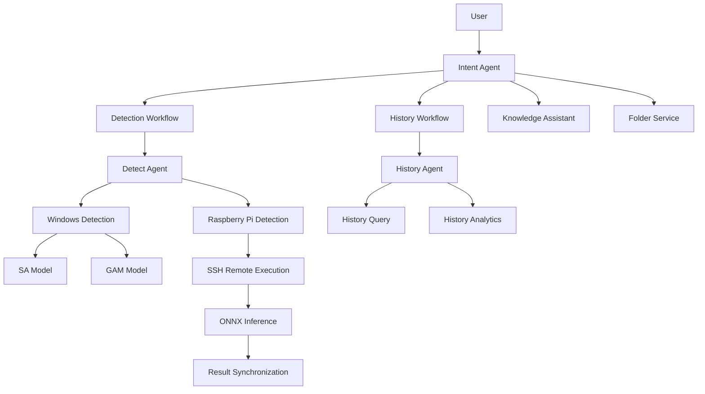

# YOLO-AMC Agent

Multi-Agent Crack Inspection Assistant powered by YOLO-AMC, Raspberry Pi Edge Deployment, and Historical Analytics.

## Overview

YOLO-AMC Agent is a multi-agent system designed for building crack inspection.

The system combines:

* Natural Language Interface
* YOLO-AMC Crack Detection
* Raspberry Pi Edge Deployment
* Historical Query System
* Historical Analytics
* Knowledge Assistant

Users can interact with the system using natural language commands without manually selecting models, devices, or workflows.

---

## System Architecture



---

## Demo

### Crack Detection (GAM Model)


---

### Edge AI Deployment (Raspberry Pi 5)


---

### History Analytics


---

## Features

### Crack Detection

* Automatic model selection
* SA (Fast Detection Mode)
* GAM (Accurate Detection Mode)
* Windows local inference
* Raspberry Pi remote inference

### Edge Deployment

* SSH remote execution
* Raspberry Pi 5 ONNX Runtime inference
* Automatic result synchronization

### History Analytics

* Confidence trend analysis
* Execution time trend analysis
* GAM vs SA comparison
* Windows vs Raspberry Pi comparison

### Knowledge Assistant

* Confidence
* FPS
* Bounding Box
* YOLO-AMC
* GAM vs SA

### Technology Stack

* Raspberry Pi 5
* SSH
* Ollama
* n8n
* Flask API
* YOLO-AMC
* ONNX Runtime
* JSON-based History Database

---

## Installation

```bash
pip install -r requirements.txt
```

### Requirements

* Python 3.10+
* Flask
* Ultralytics
* OpenCV

---

## Notes

Model weights and datasets are not included in this repository.

This repository focuses on the system architecture, workflow design, multi-agent routing, edge deployment, and historical analytics of the YOLO-AMC Agent.

Please refer to the demo videos for system demonstration.


