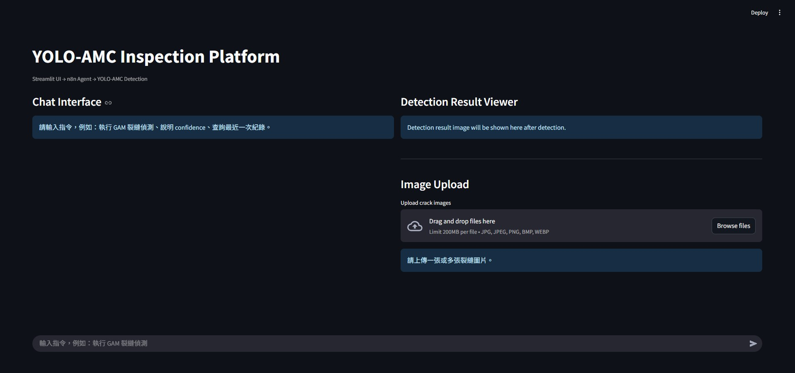
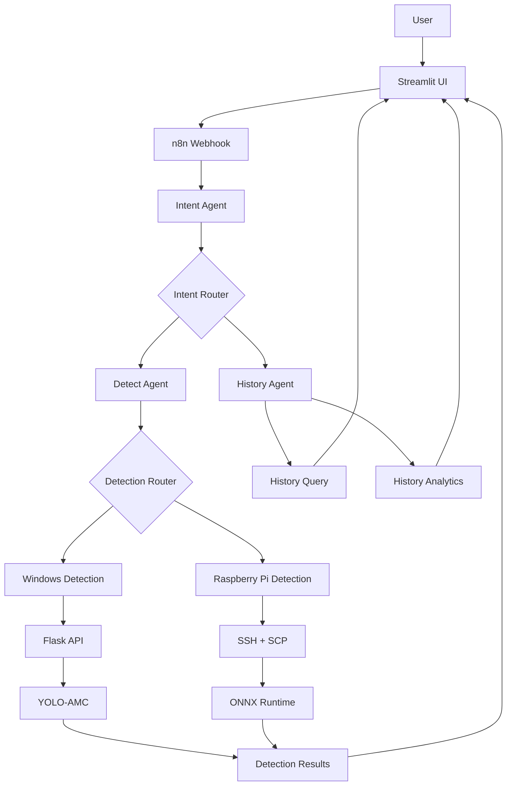

# YOLO-AMC Inspection Platform

AI-powered crack inspection platform featuring **Streamlit**, **n8n Multi-Agent System**, **YOLO-AMC**, **Raspberry Pi Edge Deployment**, and **Historical Analytics**.

<p align="center">
  
</p>

---

# Demo

## Windows Detection + Trend Analysis


---

## Raspberry Pi Detection + History Query


---

# Highlights

- Streamlit-based Web Interface
- Natural Language Interface
- n8n-based Multi-Agent System
- Automatic YOLO-AMC Model Selection
- Windows Local Crack Detection
- Raspberry Pi 5 Edge Deployment
- SSH Remote Execution
- SCP Automatic Result Synchronization
- Batch Image Upload
- Detection Result Viewer
- Detection History Query
- Historical Trend Analysis

---

# Overview

YOLO-AMC Inspection Platform is an AI-powered crack inspection platform that integrates a Streamlit web interface, an n8n multi-agent system, YOLO-AMC detection models, Raspberry Pi edge deployment, and historical analytics into a unified inspection workflow.

Users can upload one or multiple crack images and interact with the system using natural language commands. The platform automatically routes user requests, selects the appropriate detection model, performs inference on either Windows or Raspberry Pi, synchronizes detection results, and provides historical analysis without requiring manual workflow selection.

---

# Key Components

| Component | Description |
|-----------|-------------|
| Streamlit | Web User Interface |
| n8n | Multi-Agent System |
| YOLO-AMC | Crack Detection |
| Flask API | Detection Service |
| Raspberry Pi 5 | Edge Inference |
| Ollama + Qwen3 | Natural Language Understanding |
| History Analytics | Detection Trend Analysis |

---

# Features

## Streamlit Web Interface

- Natural language interaction
- Multi-image upload
- Batch crack detection
- Detection Result Viewer
- Previous / Next image navigation
- Original / Detection image switching
- Automatic result matching

---

## Multi-Agent System

- Intent Agent
- Detect Agent
- History Agent
- Detection Router
- History Router

---

## Crack Detection

- Automatic model selection
- GAM (High Accuracy)
- SA (Fast Detection)
- Windows local inference
- Raspberry Pi 5 edge inference

---

## Raspberry Pi Edge Deployment

- SSH remote execution
- SCP automatic synchronization
- ONNX Runtime inference
- Automatic synchronization back to Windows

---

## History Query

- Latest detection record
- Recent N detection records
- Detection statistics
- Best confidence record
- Fastest execution record
- History cleanup

---

## History Analytics

- Confidence trend analysis
- Execution time trend analysis
- Detection box trend analysis
- Crack image trend analysis
- GAM vs SA comparison
- Windows vs Raspberry Pi comparison

---

## Knowledge Assistant

Explain common object detection concepts, including:

- Confidence
- Bounding Box
- YOLO-AMC
- GAM vs SA

---

# System Architecture



---

# Screenshots

## Multi-image Upload


---

## Detection Result Viewer


---

## Multi-Agent Workflow


---

# Project Structure

```text
YOLO-AMC-Agent
│
├── streamlit_app.py
├── n8n_yolo_api.py
├── detect_yolo_n8n.py
├── YOLO-AMC-Agent.json
│
├── images/
├── video/
├── image_save/
├── result/
├── pi_result/
├── weights/
└── README.md
```

---

# Technologies

- Python
- Streamlit
- n8n
- Flask
- YOLO11
- YOLO-AMC (GAM / SA)
- ONNX Runtime
- Ollama
- Qwen3
- Raspberry Pi 5
- SSH / SCP

---

# Additional Demonstrations

The following demonstration videos are also included in this repository:

- Windows Detection + Trend Analysis
- Raspberry Pi Detection + History Query
- History Analytics
- Knowledge Assistant

---

# Notes

- Model weights are **not included** in this repository.
- Please place trained model weights inside the `weights/` directory before running local detection.
- Update local project paths in the configuration files before execution.
- Configure Raspberry Pi SSH settings according to your own environment.
- This project is intended for research and educational purposes.

---

# License

MIT License
